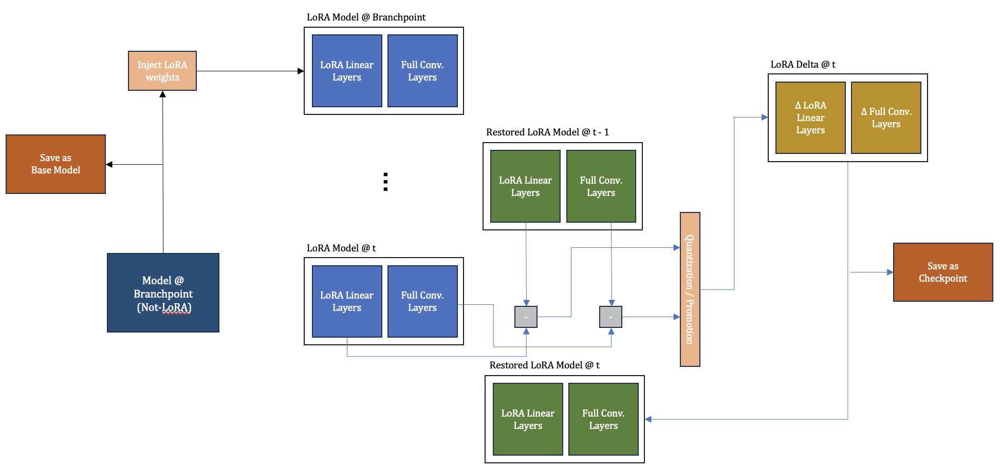
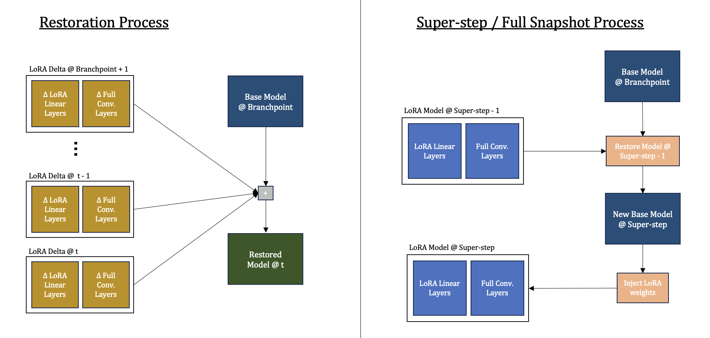

# LoBranch

### Introduction

Sequential compression framework for diverging branches in model training using Low-Rank Approximation and delta-encoding.

### Proposed Systemg

#### Compression Process

#### Restoration / Super-step Process

### Performance

#### Test parameters

| Model                  | AlexNet                   | VGG-16                    | LeNet                     |
|------------------------|---------------------------|---------------------------|---------------------------|
|     Branching Point    |           80.72%          |           72.85%          |           77.75%          |
|         Dataset        |            MNIST          |            MNIST          |            MNIST          |
|        Bit-width       |              3            |              3            |              3            |
|       LoRA Scaling     |             0.5           |             0.5           |             0.5           |
|        Batch Size      |             32            |             32            |             32            |
|      Learning Rate     |            0.01           |            0.01           |            0.01           |
|          Epochs        |             20            |             20            |             20            |
|        Super-Step      |     Every 10 iteration    |     Every 10 iteration    |     Every 10 iteration    |

### Compression Performance

Compression taken against default PyTorch pickling.

|      Model     |     Mechanism    |     Compression Ratio    |     Space Savings    |
|:--------------:|:----------------:|:------------------------:|:--------------------:|
|     AlexNet    |         LC       |          808.35%         |        87.629%       |
|                |     LC + LoRA    |         25995.409%       |        99.615%       |
|      VGG-16    |         LC       |          813.74%         |        87.711%       |
|                |     LC + LoRA    |         4188.412%        |        97.612%       |
|      LeNet     |         LC       |          537.584%        |         81.39%       |
|                |     LC + LoRA    |         1889.2869%       |        94.707%       |

### Credits

Design of the mechanism inspired by the following works:

1. Yu Chen, Zhenming Liu, Bin Ren & Xin Jin's [On Efficient Construction of Checkpoints.](https://arxiv.org/abs/2009.13003)

2. Shuyu Zhang, Donglei Wu, Haoyu Jin, Xiangyu Zou, Wen Xia & Xiaojia Huang's [QD-Compressor: a Quantization-based Delta Compression Framework for Deep Neural Networks](https://ieeexplore.ieee.org/document/9643728)

3. Amey Agrawal, Sameer Reddy, Satwik Bhattamishra, Venkata Prabhakara Sarath Nookala, Vidushi Vashishth, Kexin Rong & Alexey Tumanov's [DynaQuant: Compressing Deep Learning Training Checkpoints via Dynamic Quantization](https://arxiv.org/abs/2306.11800)

4. Edward J. Hu, Yelong Shen, Phillip Wallis, Zeyuan Allen-Zhu, Yuanzhi Li, Shean Wang, Lu Wang & Weizhu Chen's [LoRA: Low-Rank Adaptation of Large Language Models](https://arxiv.org/abs/2106.09685)

5. Yixiao Li, Yifan Yu, Qingru Zhang, Chen Liang, Pengcheng He, Weizhu Chen & Tuo Zhao's [LoSparse: Structured Compression of Large Language Models based on Low-Rank and Sparse Approximation](https://arxiv.org/abs/2306.11222)

6. Bojia Zi, Xianbiao Qi, Lingzhi Wang, Jianan Wang, Kam-Fai Wong, Lei Zhang's [Delta-LoRA: Fine-Tuning High-Rank Parameters with the Delta of Low-Rank Matrices](https://arxiv.org/abs/2309.02411)